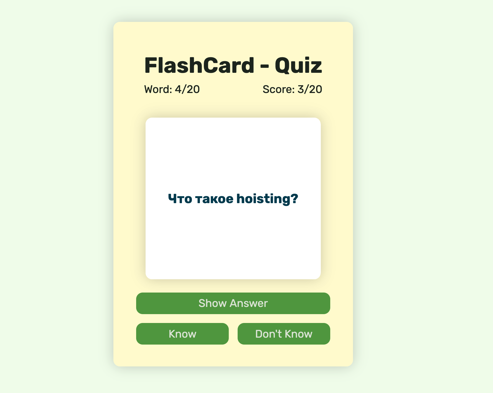

# FlashCard Quiz

Small flashcard quiz built with vanilla JavaScript for practicing basic JavaScript questions.

## Live Preview

https://onotolius.github.io/FlashCardsJS/

## Features

- 20 JavaScript questions (stored in `db.js`)
- Flip card with **Show Answer**
- **Know** / **Don't Know** buttons:
  - **Know** increases the score
  - **Don't Know** just moves to the next card
- Header shows:
  - current card: `Word: X/20`
  - current score: `Score: X/20`
- Final screen with total result after the last card
- Responsive layout with plain HTML + CSS

## Tech Stack
- HTML  
- CSS  
- Vanilla JavaScript (ES Modules)

